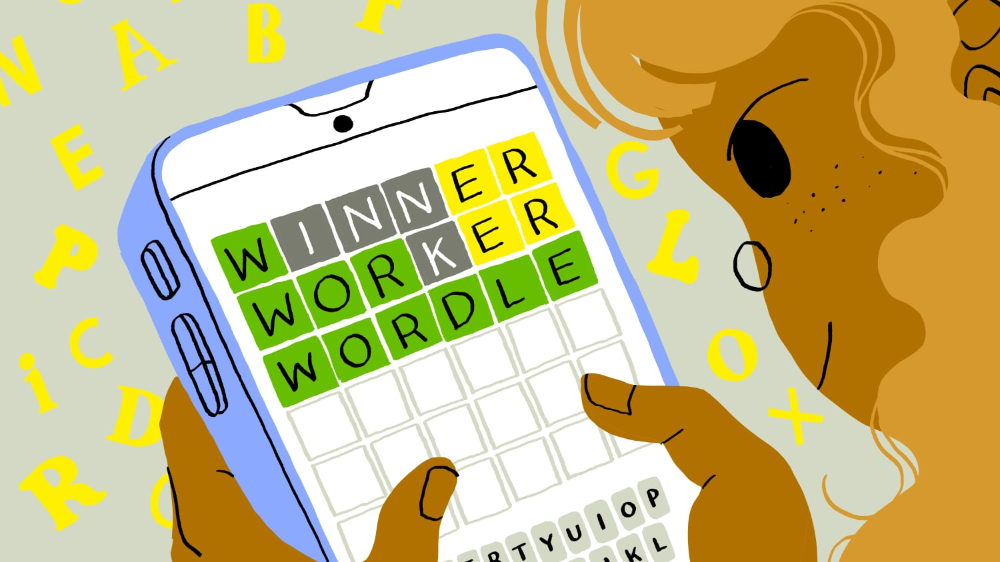

<div align="center">
  <br />
    
  <br />

  <div>
    
    
    
    
  </div>

  <h3 align="center">Wordle</h3>
</div>

---

## 📋 <a name="table">Table of Contents</a>

1. 🎮 [Introduction](#introduction)
2. ⚙️ [Tech Stack](#tech-stack)
3. 🧠 [Game Logic](#game-logic)
4. 🚀 [Getting Started](#getting-started)
5. 📦 [Deployment](#deployment)

---

## <a name="introduction">🎮 Introduction</a>

This project is an interactive **Wordle-style puzzle game**, inspired by and following the rules of the original Wordle.

It includes:

- Smooth tile animations and interactions
- Keyboard feedback
- Server–validated guesses
- Toast notifications
- Win/Lose dialogs
- A reducer-powered game engine

---

## <a name="tech-stack">⚙️ Tech Stack</a>

- **Next.js**
- **React**
- **TypeScript**
- **TailwindCSS**

---

## <a name="game-logic">🧠 Game Logic</a>

The main logic is handled inside a custom `useWordle` hook using `useReducer`.

### 🏗️ Core State

- `guesses` — all previous guesses
- `scores` — scoring arrays (0 gray, 1 yellow, 2 green)
- `currentGuess` — active user input
- `status` — `"playing" | "win" | "lose"`
- `keyColors` — mapping used to color the keyboard

### 🧩 Reducer Actions

| Action             | Description                                |
| ------------------ | ------------------------------------------ |
| `TYPE`             | Add a typed letter                         |
| `DELETE`           | Remove last letter                         |
| `ADD_GUESS`        | Submit a validated guess                   |
| `APPLY_KEY_COLORS` | Update keyboard colors using scoring rules |
| `SET_STATUS`       | End game with win/lose                     |
| `RESET`            | Restart game                               |

## <a name="getting-started">🚀 Getting Started</a>

Follow these steps to run the project locally.

---

### **Install dependencies**

```bash
npm install
```

### **Start the server**

```bash
npm run dev
```

### **Use the provided URL to access the validation endpoint**

[WORDLE_URL](https://wordle-apis.vercel.app/api/validate)

## <a name="deployment">📦 Deployment</a>

### **Please follow the link below to play the deployed version of the game!**

[WORDLE](https://wordletoday.vercel.app/)
